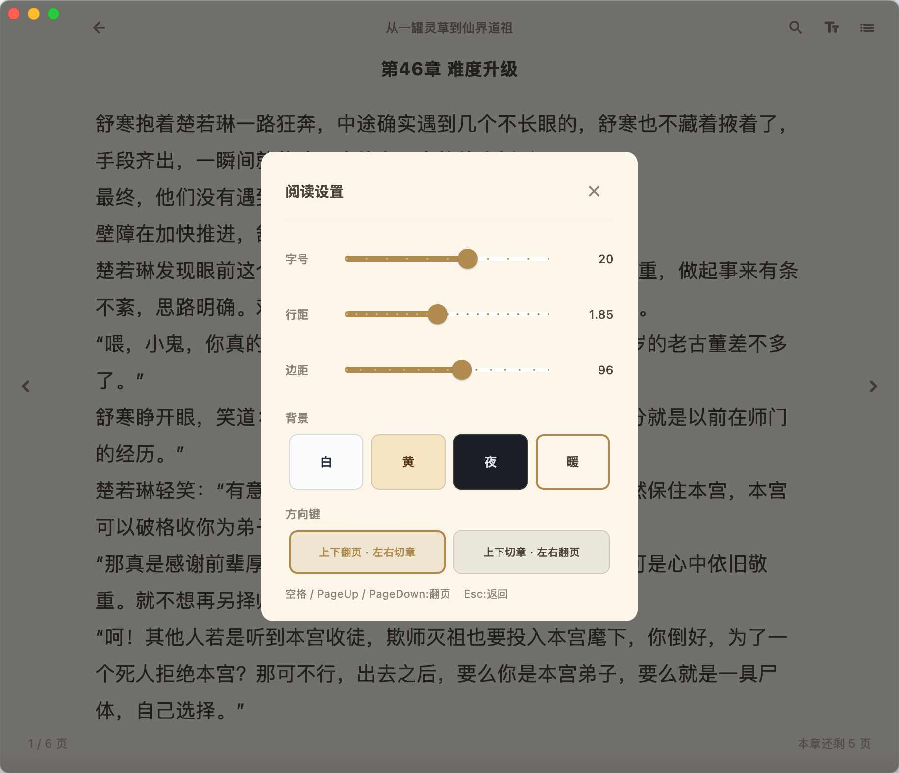

# 阅读 (novel_reader)

Flutter macOS 小说阅读器 —— 本地书架 · EPUB 解析 · 沉浸式分页阅读 · 番茄小说在线导入下载。

应用名：**阅读**（macOS 窗口/包显示名为「书架」）。

## 功能特性

- **本地书架**：封面网格展示 + 侧边栏阅读进度列表，一键导入 EPUB（封面/元数据/正文自动解析入架）
- **沉浸式阅读**：无边框透明标题栏，正文分页填满整页；章节搜索定位、目录跳转、键盘翻页
- **阅读设置**：字号 / 行距 / 边距实时调节，4 种背景主题（白 / 黄 / 夜 / 暖），两种方向键操作模式
- **进度持久化**：自动记录章节 + 页码，切章 / 退出即时落盘，随时接着读
- **在线导入番茄小说**：粘贴书籍链接或纯 ID → 选章范围 → 全本下载入架，中断可续传
  - VIP / 付费章：可粘贴浏览器登录 Cookie 下载账号有权限的章节（Cookie 仅本次内存携带，不落盘）
  - 备用中转源（实验性）：解决部分「网页标 VIP、但手机 App 游客可全本读」的书，一键开关即全本下载
  - 试读防误入库：正文短于真实字数一半的片段自动判为试读并跳过

## 安装（macOS）

从 GitHub Releases 下载最新版：

**https://github.com/MX-future/novels-read/releases**

```bash
# 以 v1.2 为例
curl -LO https://github.com/MX-future/novels-read/releases/download/v1.2/default.zip
unzip default.zip -d /Applications
```

> 应用未做签名/公证，首次打开需在 Finder 中**右键 → 打开**（或 系统设置 → 隐私与安全性 → 仍要打开）。

## 截图

### 书架主页
左侧侧边栏展示书籍列表与阅读进度，右侧书籍封面网格显示当前已读百分比。


### 阅读界面
沉浸式阅读视图：顶部 macOS 标题栏 + 搜索/设置/目录按钮，正文居中显示，左右半透明翻页按钮，底部极简页码。


### 阅读设置
悬浮对话框：字号/行距/边距滑块、4 种背景主题(白/黄/夜/暖)、方向键控制模式(上下翻页/左右切章 或 上下切章/左右翻页)。



## 在线导入番茄小说

- **入口**：书架侧边栏「在线导入(番茄)」（空书架时也有中央入口）
- **输入**：`https://fanqienovel.com/page/{bookId}` 链接或纯 `bookId` 均可
- **选章**：支持指定起始 ~ 结束章（留空 = 全本），下载前预览书名/作者/字数/免费与 VIP 章数
- **下载**：免费章直接全文入库；VIP 章默认跳过，可展开「登录 Cookie」粘贴番茄网页登录态 Cookie 后下载有权限的章节（F12 → Network → 任意请求 → 复制 Cookie 请求头）
- **备用源（实验性，默认关）**：针对 web 端整本标 VIP、但手机 App 游客态即可全本读的书。开启后自动走 SSR → Cookie → 备用源三级取文，实测可全本下载此类书
- **说明**：Cookie 仅本次下载携带、不保存；备用源为社区第三方中转（可能失效），故默认关闭。正文是否试读由服务端按账号权益决定——「无权限返回约 200 字试读」是官方机制，不是本地解析问题

## 构建与运行

使用项目脚本（自动处理国内 pub 镜像 + Xcode 路径）：

```bash
# 构建 Release 版本到 build/macos/Build/Products/Release/书架.app
bash scripts/build_macos.sh

# Debug 构建
bash scripts/build_macos.sh --debug

# 开发热重载运行
bash scripts/run_macos.sh
```

> 脚本会自动设置：
> - `PUB_HOSTED_URL=https://pub.flutter-io.cn`
> - `FLUTTER_STORAGE_BASE_URL=https://storage.flutter-io.cn`
> - `DEVELOPER_DIR=/Applications/Xcode.app/Contents/Developer`（如果 Xcode.app 已安装）
>
> 不需要手动 export 环境变量。
>
> 在线导入需要网络权限（沙箱已配置 `network.client`），首次运行若被拦截请在系统设置中允许。

## 目录结构

```
lib/
├── screens/                 # 书架页 / 阅读页 / 番茄导入对话框
├── services/
│   ├── epub_service.dart    # EPUB 解析与书籍落盘
│   ├── fanqie/              # 番茄在线：目录/正文抓取、PUA 解码表、Cookie/备用源下载
│   ├── progress_store.dart  # 阅读进度持久化
│   └── reader_settings.dart # 阅读设置（全局共享 + 持久化）
├── utils/                   # HTML 清洗、TextPaginator 分页
├── widgets/                 # 书架网格 / 侧边栏条目
└── main.dart
assets/icon/        # 合规应用图标源文件（1024×1024, RGB 无 alpha）
macos/              # Flutter 生成的 macOS 工程
scripts/            # 构建脚本（build_macos.sh, run_macos.sh）
test/               # 单元测试（分页/设置/进度/解码/番茄服务等 101 例）
```

## 应用图标

- 合规源文件位于 `assets/icon/`（暖色书本主用、夜色月光备用，均 1024×1024）
- macOS AppIcon 位于 `macos/Runner/Assets.xcassets/AppIcon.appiconset/`（已自动生成 16/32/64/128/256/512/1024 全套）
- 切换图标：编辑 `.workbuddy/scripts/apply_app_icon.py` 的 `SRC` 路径再执行；如需调整主体大小（"内边距"），编辑 `.workbuddy/scripts/redo_app_icon.py` 的 `SCALE`
